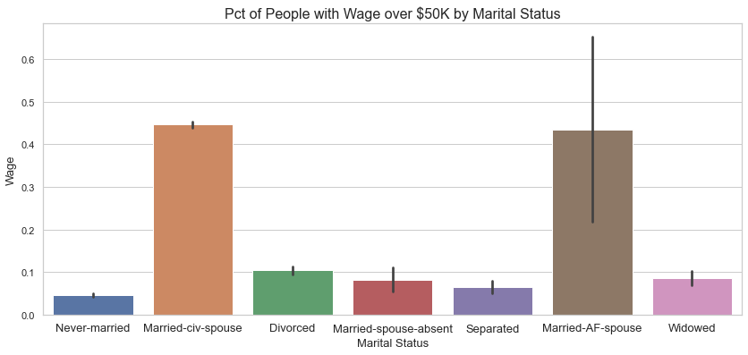
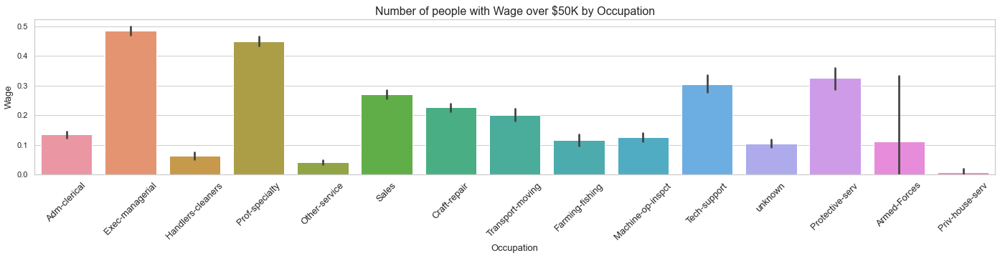
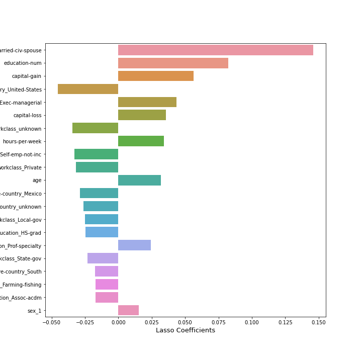

# Income Prediction
</img>

## Contents

* [Executive Summary](#Executive-Summary)
* [Problem Statement](#Problem-Statement)
* [Process](#Process)
* [Conclusion and Suggestions](#Conclusion-and-Suggestions)
* [Data Dictionary](#Data-Dictionary)

## Executive Summary

In processing and analyzing this census data, we found our AdaBoost model to be the most effective with an 87% accuracy score in predicting which values or features contribute the most in signifying if an individual makes over \\$50k dollars a year.

Coming in at a close 2nd was our random forest model, which had a testing accuracy score of 86%.  

We found that there was a positive relationship between marital status and wage, meaning that an individual was more likely to make over \\$50k dollars a year if they are married.  

We also found that in our data, approximately 30% of men make over \\$50k a year compared to the 11% of women in this salary bracket.  

Even with a maximum limit of 20 features, we were still able to achieve scores over our baseline of 76%, showcasing that our models prove to be useful despite the constraint.  

In summary, we believe that our model would be most useful to companies in the financial services industry interested in making business decisions on how /if an individual gets approved for a loan.
We look forward to working closely with companies that can implement our models and we’re excited to be involved in revolutionizing the industry.

## Problem Statement

Income level can affect the financial freedom, opportunities, and quality of life of an individual. Unfortunately, understanding the factors that contribute to income and predicting the income is a difficult task for most businesses and individuals. This leads to businesses targeting the wrong customers and individuals failing to meet financial goals. 
In this project, we will focus on building a model to predict if a person's income is in excess of \$50,000 given certain profile information, so that we can better solve this problem for businesses and individuals.

## Process

* <b>Data Cleaning</b> 
Even though the dataset didn't have much missing values, it contained a lot of white space. We removed the empty space first, and then replaced any value that had a question mark to 'unknown' - although they seemed small proportion, about 10% of those were making over 50,000 dollars, we decided to leave them in the dataset. 
 
* <b>Exploratory Data Analysis and Visualization</b> 
For exploratory data analysis, we looked at the categorical variables against wage, which is our target variable. From this step, we were able to find marital status is one of the strong indicators of someone's income, as well as occupation and workclass. 

  
  
  

* <b>Feature Engineering</b> 
We created a few columns - including polynomial features and dummified columns for categorical variables. We ended up not using any of polynomial variables for Lasso method to select the best features for our prediction, however. 
    
* <b>Modeling</b> 
First we ran several models at the same time to find out the weakest model, which was KNN. We excluded KNN, then worked on finding the best parameters for each model: Logistic Regression, Decision Trees, Random Forest, Multinomial Naive Bayes, Bagging Classifier, AdaBoost, and Support Vector Machines. Once we decided on the models, we individually ran GridSearch model with pipelines. From these models, we again decided to run VotingClassifier to find the best performing model.

* <b>Best Model</b> 
The model that performed best was Adaboost model with 2500 estimators. Its train dataset accuracy was 86.9% and 87.2% for test dataset. Although this was better than the baseline accuracy (<50K (0), ~75%, and >50K (1), ~25%), we could not achieve better prediction from this model. 

## Conclusion and Suggestions

Even though our best model performed better than baseline accuracy, we were able to only achieve 87% accuracy. Our model could be used to predict someone's income in categorical values, so that we could derive the loan approval in binary fashion, however we will need more adjustment, such as more variables or bigger dataset, in our model to get better results.

## Data Dictionary

Data dictionary to the datasets that were used in this project can be found <a href='https://archive.ics.uci.edu/ml/datasets/adult' target="_blank">here.</a>

## Directory

|__ Data 
|&nbsp;&nbsp;&nbsp;&nbsp;&nbsp;|__ [Cheap Train Sample](./data/cheap_train_sample.csv) 
|&nbsp;&nbsp;&nbsp;&nbsp;&nbsp;|__ [Large Train Sample](./data/large_train_sample.csv) 
|&nbsp;&nbsp;&nbsp;&nbsp;&nbsp;|__ [Submission](./data/submission.csv) 
|&nbsp;&nbsp;&nbsp;&nbsp;&nbsp;|__ [Test Data](./data/test_data.csv) 
|&nbsp;&nbsp;&nbsp;&nbsp;&nbsp;|__ [Clean Train Data](./data/train_cleaned.csv) 
|&nbsp;&nbsp;&nbsp;&nbsp;&nbsp;|__ [Dummified Train Data](./data/train_modeling.csv) 
|__ Images 
|&nbsp;&nbsp;&nbsp;&nbsp;&nbsp;|__ [Income Header Image](./images/income.jpg) 
|&nbsp;&nbsp;&nbsp;&nbsp;&nbsp;|__ [Lasso Coefficients](./images/lasso.png) 
|&nbsp;&nbsp;&nbsp;&nbsp;&nbsp;|__ [Wage and Marital Status](./images/wage_over_50K_marital_status.png) 
|&nbsp;&nbsp;&nbsp;&nbsp;&nbsp;|__ [Wage and Occupation](./images/wage_over_50K_occuptaion.png) 
|&nbsp;&nbsp;&nbsp;&nbsp;&nbsp;|__ [Wage and Relationship](./images/wage_over_50K_relationship.png) 
|&nbsp;&nbsp;&nbsp;&nbsp;&nbsp;|__ [Wage and Sex](./images/wage_over_50K_sex.png) 
|&nbsp;&nbsp;&nbsp;&nbsp;&nbsp;|__ [Wage and Work Class](./images/wage_over_50K_workclass.png) 
|__ [Cleaning and EDA](./01-DataCleaningEDA.ipynb) 
|__ [Feature Engineering](./02-FeatureEng.ipynb) 
|__ [Modeling](./03-Modeling.ipynb) 
|__ [Presentation](./Income_Prediction_Presentation.pdf) 
|__ [README.md](./README.md)